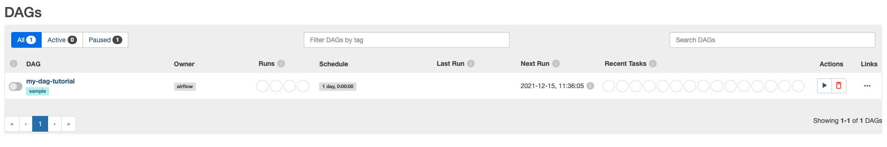

# Airflow Operators

## Setup

```sh
docker compose up airflow-init
docker compose up -d
```

Open browser on http://localhost:8080 and login with `airflow` / `airflow`.



## Postgres Connection

To connect to a postgres database, first create on the UI the connection:

* Conn ID: `postgres_default` (The default connection id used by the postgres operator)
* Conn Type: `postgres`
* Host: `postgres` (The connection info can be found on the `docker-compose.yaml` under `AIRFLOW__CORE__SQL_ALCHEMY_CONN` we re-use the running postgres for the example)
* Schema: `airflow`
* Login: `airflow`
* Password: `airflow`

DAGs:

* `operators_postgres` ([Reference](https://github.com/apache/airflow/tree/main/airflow/providers/postgres/example_dags))
* `pipeline_example` ([Reference](https://airflow.apache.org/docs/apache-airflow/stable/tutorial.html#pipeline-example))

## Pipeline Example

For details read the documentation [here](https://airflow.apache.org/docs/apache-airflow/stable/tutorial.html#pipeline-example)

