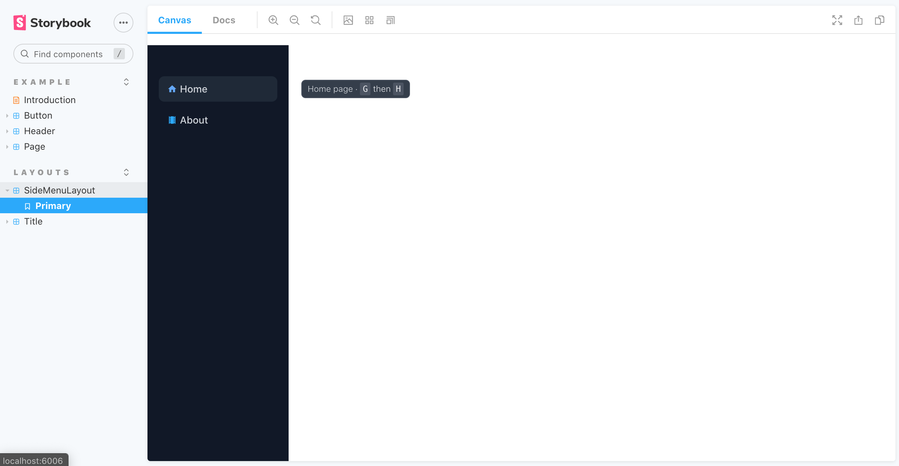

# Day 2

During this day we setup storybook and add basic UI components.

## Setup Storybook

[Storybook](https://storybook.js.org/) is an open source tool for developing UI components in isolation for React.



### Init Storybook

We use `@next` version and a specific builder to leverage vite for hot reload.

```sh
npx sb@next init --builder storybook-builder-vite
```

### Start Storybook

Now we can start the storybook with:

```tsx
> yarn storybook
╭───────────────────────────────────────────────────╮
│                                                   │
│   Storybook 6.1.21 started                        │
│   15 s for preview                                │
│                                                   │
│    Local:            http://localhost:6006/       │
│    On your network:  http://192.168.0.13:6006/    │
│                                                   │
╰───────────────────────────────────────────────────╯
```


### Use Storybook

Create `src/ui/layouts/SideMenu.stories.tsx`:

```tsx
// also exported from '@storybook/react' if you can deal with breaking changes in 6.1
import { Meta, Story } from '@storybook/react/types-6-0';
import SideMenu from './SideMenu';
import { MemoryRouter } from 'react-router-dom';

export default {
  title: 'Layouts/SideMenu',
  component: SideMenu,
  argTypes: {
  },
} as Meta;

const Template: Story = (args) => <MemoryRouter><SideMenu {...args}>{ }</SideMenu></MemoryRouter>;

export const Primary = Template.bind({});
Primary.args = {
};
```

Now we need to storybook to run postcss and autoprefixer to get the tailwind styles baked in. Update `.storybook/preview.js` importing `index.css`:

```diff
+import '../src/index.css';

export const parameters = {
  actions: { argTypesRegex: "^on[A-Z].*" },
  controls: {
    matchers: {
      color: /(background|color)$/i,
      date: /Date$/,
    },
  },
}
```

**Next**: [Add UI Buttons](2.add-ui-buttons.md)