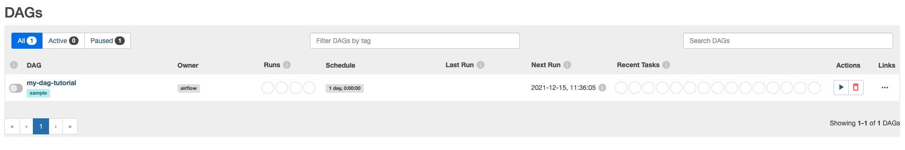

# Airflow DAGs

## Setup

```sh
docker compose up airflow-init
docker compose up -d
```

Open browser on http://localhost:8080 and login with `airflow` / `airflow`.



## Declaring DAGs

For details read the documentation [here](https://airflow.apache.org/docs/apache-airflow/stable/concepts/dags.html)

We have three different ways to declare DAGs:

* `declare_dag_with_constructor`
* `declare_dag_with_context_manager`
* `declare_dag_with_decorator`

I prefer the decorator and will use that for further examples.

To dry run the DAG declarations simply do:

```sh
python {DAG_FILE}.py
```

It should exit without any errors if DAG is declared correctly.

## Task Dependencies

There are different ways to define the dependencies between the DAG tasks:

* `task_dependencies_operators`
* `task_depenendcies_downstream`
* `task_dependencies_chain`
* `task_dependencies_chain_pairwise`

## CLI

We can test run specific tasks or entire dags by doing the following:

```sh
# Run airflow CLI inside a container in interactive mode
$ ./airflow bash

## testing task "op1" from dag "task_dependencies_chain"
$ airflow tasks test task_dependencies_chain op1 2015-06-01
...
[2021-12-17 15:27:36,644] {taskinstance.py:1280} INFO - Marking task as SUCCESS. dag_id=task_dependencies_chain, task_id=op1, execution_date=20150601T000000, start_date=20211217T152736, end_date=20211217T152736

## testing task "op2" from dag "task_dependencies_chain"
$ airflow tasks test task_dependencies_chain op2 2015-06-01
...
[2021-12-17 15:28:43,122] {taskinstance.py:1280} INFO - Marking task as SUCCESS. dag_id=task_dependencies_chain, task_id=op2, execution_date=20150601T000000, start_date=20211217T152843, end_date=20211217T152843

## testing dag "task_dependencies_chain"
$ airflow dags test task_dependencies_chain 2021-12-15
...
[2021-12-17 15:29:23,875] {dagrun.py:602} INFO - DagRun Finished: dag_id=task_dependencies_chain, execution_date=2021-12-15T00:00:00+00:00, run_id=backfill__2021-12-15T00:00:00+00:00, run_start_date=2021-12-17 15:29:03.767633+00:00, run_end_date=2021-12-17 15:29:23.875553+00:00, run_duration=20.10792, state=success, external_trigger=False, run_type=backfill, data_interval_start=2021-12-15T00:00:00+00:00, data_interval_end=2021-12-16T00:00:00+00:00, dag_hash=None
```

Or we can do a `backfill` to run the DAG multiple times for a specific date range and also register the state in the DB:

```sh
## backfill dag "task_dependencies_chain"
$ airflow dags backfill task_dependencies_chain --start-date 2015-06-01 --end-date 2015-06-14
...
[2021-12-17 15:31:42,921] {backfill_job.py:397} INFO - [backfill progress] | finished run 14 of 14 | tasks waiting: 0 | succeeded: 56 | running: 0 | failed: 0 | skipped: 0 | deadlocked: 0 | not ready: 0
```

