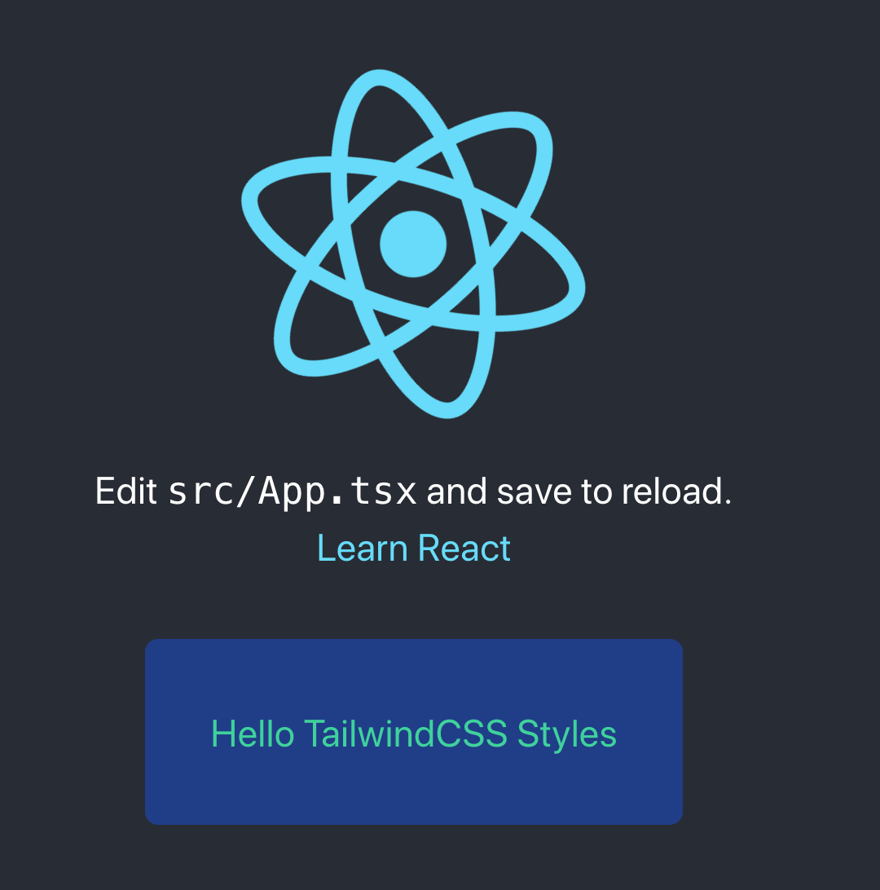
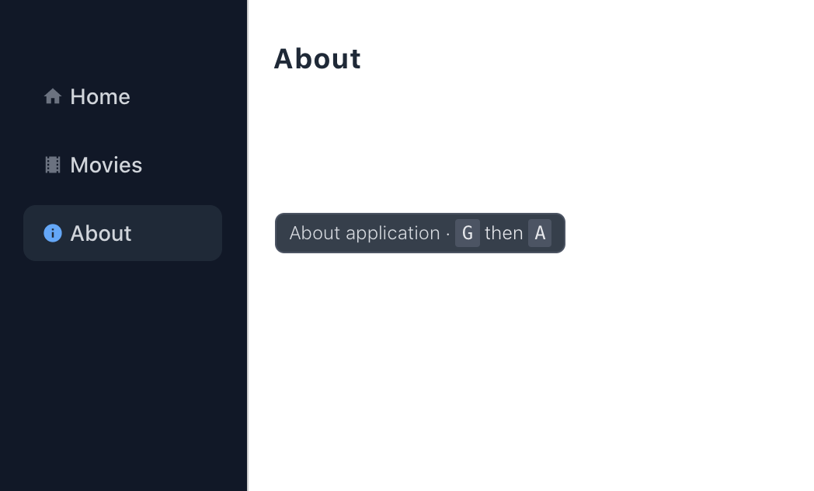
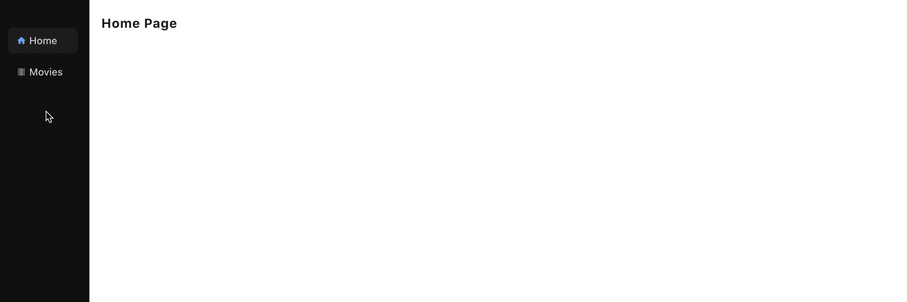

# Day 1

During this day we setup the react app, install [Tailwind CSS], configure page navigation and prepare a side menu with tooltips and keyboard shortcuts. Once finished we prepare an ARCHITECTURE.md that describes in high-level the system.

[Tailwind CSS]:https://tailwindcss.com/

## Setup React App

To bootstrap the project we'll use [vite]

[vite]:https://vitejs.dev/

```sh
yarn create vite my-react-workshop --template react-ts
cd my-react-workshop
yarn
```

Start app

```sh
yarn dev
```

## Setup Tailwind CSS

We'll use [Tailwind CSS] as a utility-first CSS framework.

Install Tailwind

```sh
yarn add -D tailwindcss@latest postcss@latest autoprefixer@latest
```

Create configuration files

```sh
npx tailwindcss init -p
```

In your `tailwind.config.js` file, configure the `purge` option with the paths to all of your pages and components so Tailwind can tree-shake unused styles in production builds:

```diff
// tailwind.config.js
module.exports = {
- purge: [],
+ purge: ['./index.html', './src/**/*.{vue,js,ts,jsx,tsx}'],
  darkMode: false, // or 'media' or 'class'
  theme: {
    extend: {},
  },
  variants: {
    extend: {},
  },
  plugins: [],
}
```

Replace `src/index.css` with the following to include Tailwind:

```css
/* ./src/index.css */
@tailwind base;
@tailwind components;
@tailwind utilities;
```

Let's test it by adding a styled paragraph on src/App.tsx:

```diff
Learn React
+ <p className="bg-blue-900 rounded-lg m-10 p-10 text-green-400">Hello TailwindCSS Styles</p>
```

Start app

```sh
yarn dev
```



## Add Page Navigation

To add page navigation we'll use [react-router-dom](https://reactrouter.com/web/guides/quick-start):

```jsx
yarn add react-router-dom @types/react-router-dom
```

Create two pages `src/pages/Home.tsx`:

```jsx
export default function Home() {
  return (
    <h1>Home Page</h1>
  );
}
```

`src/pages/About.tsx`:

```jsx
export default function About() {
  return (
    <h1>About</h1>
  );
}
```

Update App to use navigation:

```jsx
import {
  BrowserRouter as Router, Route, Routes
} from "react-router-dom";
import './App.css';
import About from './pages/About';
import Home from './pages/Home';

function App() {
  return (
    <Router>
      <Routes>
        <Route path="/" element={<Home />}/>
        <Route path="/about" element={<About />}/>
      </Routes>
    </Router>
  )
}

export default App;
```

To test it open app (`yarn dev`) and navigate on:

- [http://localhost:3000/](http://localhost:3000/about)
- [http://localhost:3000/about](http://localhost:3000/about)

## Add Keyboard shortcuts



To add keyboard shortcuts we'll use `mousetrap`

```bash
yarn add mousetrap @types/mousetrap
```

Create a hook for mousetrap `src/hooks/use-mousetrap.ts`:

```tsx
// src/hooks/use-mousetrap.ts

// reference: https://github.com/olup/react-hook-mousetrap
import mousetrap, { ExtendedKeyboardEvent } from "mousetrap";
import { useEffect, useRef } from "react";

/**
 * Use mousetrap hook
 *
 * @param  {(string | string[])} handlerKey - A key, key combo or array of combos according to Mousetrap documentation.
 * @param  { function } handlerCallback - A function that is triggered on key combo catch.
 * @param  { string } evtType - A string that specifies the type of event to listen for. It can be 'keypress', 'keydown' or 'keyup'.
 */
const useMousetrap = (handlerKey: string | string[], handlerCallback: () => void, evtType?: "keypress" | "keydown" | "keyup") => {
  var actionRef: any
  actionRef = useRef(null);
  actionRef.current = handlerCallback;

  useEffect(() => {
    mousetrap.bind(handlerKey, (evt: ExtendedKeyboardEvent, combo: string | string[]) => {
      typeof actionRef.current === "function" && actionRef.current(evt, combo);
    }, evtType);
    return () => {
      mousetrap.unbind(handlerKey, evtType);
    };
  }, [handlerKey, actionRef, evtType]);
};

export default useMousetrap
```

Create `src/shortcuts/KeyboardShortcuts.tsx`:

```tsx
import useMousetrap from '../hooks/use-mousetrap';
import React from 'react';
import { useHistory } from 'react-router-dom';

function KeyboardShortcuts() {
  const history = useHistory()

  // shortcuts
  useMousetrap("g h", () => history.push("/"));
  useMousetrap("g m", () => history.push("/movies"));
  useMousetrap("g a", () => history.push("/about"));

  return <></>
}

export default KeyboardShortcuts
```

Now connect that to `src/App.tsx`:

```diff
import React from 'react';
import {
  BrowserRouter as Router, Route, Switch
} from "react-router-dom";
import './App.css';
import SideMenu from './layouts/SideMenu';
import About from './pages/about';
import Home from './pages/home';
+ import KeyboardShortcuts from './shortcuts/KeyboardShortcuts';

function App() {
  return (
    <Router>
+     <KeyboardShortcuts />
      <Switch>
        <Route exact path="/about"><About /></Route>
        <Route exact path="/"><Home /></Route>
      </Switch>
    </Router>
  )
}

export default App
```

## Add SideMenu

Add SideMenu with icons, active and hoverable states and persisted sizeable pane:



### The components

For the above SideMenu we use the following components:

- @material-ui/icons: The Icons.
- react-split-pane: The Resizable Split Pane.
- react-use: The hook for persistence using localStorage.

```bash
yarn add @material-ui/core @material-ui/icons react-use react-split-pane
```

### The Code

Add `src/ui/layouts/SideMenu.tsx`

```tsx
// src/ui/layouts/SideMenu.tsx

import { Home, Info, Movie } from '@material-ui/icons';
import React from 'react';
import { NavLink } from 'react-router-dom';
import SplitPane from 'react-split-pane';
import { useLocalStorage } from 'react-use';
import TooltipWithShortcut from '../tooltips/TooltipWithShortcut';

interface SideMenuProps { children: any }
export default function SideMenu({ children }: SideMenuProps) {
  const [value, setValue] = useLocalStorage('sidemenu.size', 200);
  return (
    <div className="flex z-30 h-full">
      <SplitPane onDragFinished={setValue} split="vertical" minSize={130} defaultSize={value} maxSize={400}>
        <Menu />
        <div className="z-10 p-4 overflow-auto h-full">
          {children}
        </div>
      </SplitPane>
    </div>
  )
}

// Menu at the top with navigation buttons
function Menu() {
  return (
    <nav className="bg-gray-900 w-full flex flex-col h-full pt-10 text-gray-500">
      <NavButton icon={<Home fontSize="small" />} exact to='/' title="Home" description="Home page" shortcut="H" />
      <NavButton icon={<Movie fontSize="small" />} exact to='/movies' title="Movies" description="Movies" shortcut="M" />
      <NavButton icon={<Info fontSize="small" />} to='/about' title="About" description="About application" shortcut="A" />
    </nav>
  )
}


// navigation button on menu
interface NavButtonProps { to: string, title: string, description?: string, shortcut?: string, exact?: boolean, icon?: any }
function NavButton({ exact = false, to, title, description, shortcut, icon }: NavButtonProps) {
  return <div>
    <TooltipWithShortcut description={description} shortcut={shortcut} placement="right">
      <NavLink data-tip data-for={title} activeClassName="text-blue-400  bg-gray-800" exact={exact} to={to} className="
  my-1 mx-4 px-3 py-2 rounded-lg text-sm font-medium
 hover:bg-gray-800 flex items-center
  focus:outline-none space-x-1
">{icon}<span className="text-gray-300">{title}</span></NavLink>
    </TooltipWithShortcut>
  </div>
}

```

React Split Pane needs some CSS to be included on `src/App.css`:

```css
.Resizer {
  background: #000;
  opacity: 0.2;
  z-index: 1;
  -moz-box-sizing: border-box;
  -webkit-box-sizing: border-box;
  box-sizing: border-box;
  -moz-background-clip: padding;
  -webkit-background-clip: padding;
  background-clip: padding-box;
}

.Resizer:hover {
  -webkit-transition: all 2s ease;
  transition: all 2s ease;
}

.Resizer.horizontal {
  height: 11px;
  margin: -5px 0;
  border-top: 5px solid rgba(255, 255, 255, 0);
  border-bottom: 5px solid rgba(255, 255, 255, 0);
  cursor: row-resize;
  width: 100%;
}

.Resizer.horizontal:hover {
  border-top: 5px solid rgba(0, 0, 0, 0.5);
  border-bottom: 5px solid rgba(0, 0, 0, 0.5);
}

.Resizer.vertical {
  width: 11px;
  margin: 0 -5px;
  border-left: 5px solid rgba(255, 255, 255, 0);
  border-right: 5px solid rgba(255, 255, 255, 0);
  cursor: col-resize;
}

.Resizer.vertical:hover {
  border-left: 5px solid rgba(0, 0, 0, 0.5);
  border-right: 5px solid rgba(0, 0, 0, 0.5);
}
.Resizer.disabled {
  cursor: not-allowed;
}
.Resizer.disabled:hover {
  border-color: transparent;
}
```

### The App

Connect SideMenuLayout to `App.tsx`:

```diff
import React from 'react';
import {
  BrowserRouter as Router, Route, Switch
} from "react-router-dom";
import './App.css';
+import SideMenu from './layouts/SideMenu';
import About from './pages/About';
import Home from './pages/Home';

function App() {
  return (
    <Router>
+      <SideMenu>
        <KeyboardShortcuts />
        <Switch>
			  	<Route exact path="/"><Home /></Route>
          <Route exact path="/about"><About /></Route>
        </Switch>
+      </SideMenu>
    </Router>
  )
}

export default App;
```

## Add ARCHITECTURE.md

Architecture markdown should include a high-level architecture documentation.

Add the following as starting point:

````markdown
# Architecture

### Directory Layout

Before you start, take a moment to see how the project structure looks like:

```sh
.
├── /src/                       # The source code of the application
|   | # Typescript
│   ├── /models/                # Data models
│   ├── /actions/               # The actions to external APIs
│   ├── /stores/                # The stores that handle declarative state of the APIs actions.
|   | # UI Components
|   ├── /components/            # Reusable basic components of the UI that are isolated (e.g. buttons)
|   ├── /layouts/               # Reusable layouts of the UI
|   ├── /cards/                 # Reusable components of the UI that can use stores
|   ├── /pages/                 # Pages of the application
├── /dist/                      # The folder for compiled output
├── /node_modules/              # The dependencies
├── .gitignore                  # List of files that should be ignored by git
├── ARCHITECTURE.md             # ARCHITECTURE file
├── index.html                  # The index.html file
├── Dockerfile                  # Commands for building a Docker image for production
├── README.md                   # README file
├── package-lock.json           # Fixed versions of all the dependencies
├── package.json                # The list of 3rd party libraries and utilities
├── postcss.config.js           # Configuration of PostCSS used by Tailwind
├── tailwind.config.js          # Configuration of Tailwind
├── tsconfig.json
```

**NOTE**: Source code is ordered by dependency tree (each directory can only use upper ones)
````

**Next**: [Day 02](../day02/README.md)